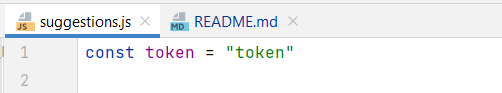
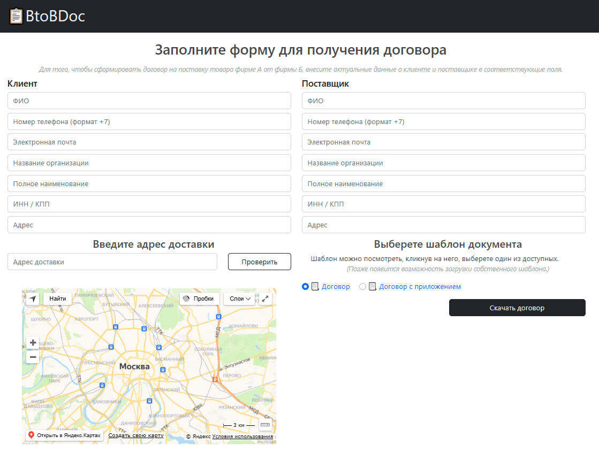
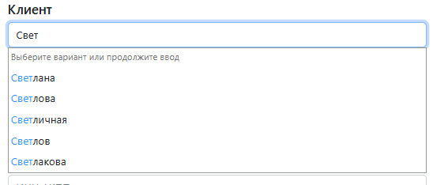
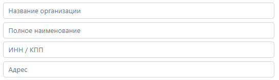
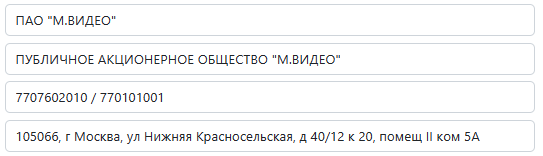
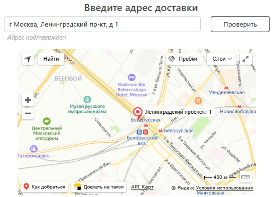
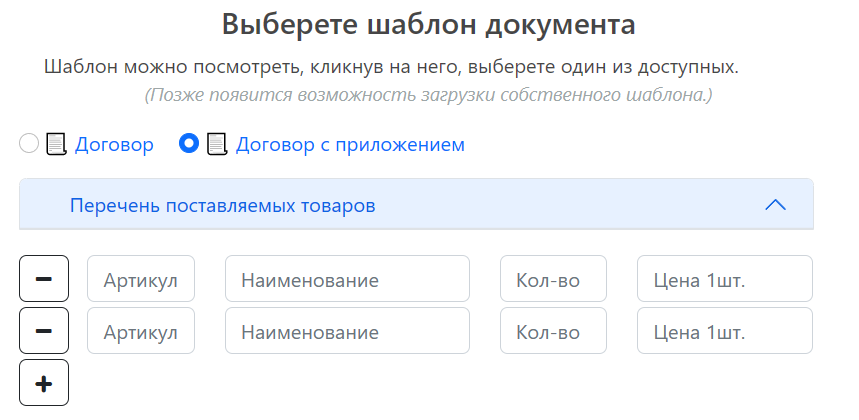

# BtoBDoc

## назначение

Сервис для автоматического заполнения договора на поставку товара от фирмы А к фирме Б.
Для заполнения документа пользователю требуется заполнить форму в веб-интерфейсе и выбрать шаблон договора.
После заполнения всех полей формы готовый документ скачивается пользователю на устройство.

## инструкция настройки и запуска

Чтобы запустить сервис, нужно набрать в консоли в папке с проектом команду:

```
go run ./cmd/main.go -p my_folder -c my_config
```

Если флаги не указаны, сервис будет искать файл конфигурации в пути по умолчанию: директория **configs**, файл **config**.
Для того чтобы указать свои путь и название файла конфигурации можно добавить флаги в команду:

- **--path** или **-p** - путь до директории с файлом конфигурации
- **--config** или **-с** - название файла конфигурации без расширения

Для чтения файла конфигурации используется библиотека [spf13/viper](https://github.com/spf13/viper). Рекомендуется
выбрать один из поддерживаемых библиотекой форматов конфигурации, например - **yml**, **json** или **toml**.
Пример:

```toml
[paths]
templatePath = "docs/templates/"
outPath = "docs/output/"

[server]
httpPort = "8080"
```

Требуется зарегистрироваться на сайте [Dadata.ru](https://dadata.ru/) получить свой токен и вставить его в файл frontend/js/suggestions.js



## заполнение документа

После запуска сервиса, на порту, указанном в файле конфигурации, будет доступен пользовательский интерфейс.
Внешний вид интерфейса представлен ниже:



Для того чтобы получить договор, требуется заполнить все поля формы.
При вводе данных в поля формы срабатывают подсказки с сервиса [Dadata.ru](https://dadata.ru/)



При выборе одной из подсказанных компаний будут заполнены автоматически поля: 
- наименование компании
- полное наименование компании
- ИНН/КПП
- адрес

|| |
|---|---|

Адрес доставки валидируется с помощью встроенной на сайт карты. Договор с не подтвержденным
адресом сформировать невозможно.



На данный момент в сервисе доступно два шаблона договора: стандартный и с приложением(товары).
Нажав на название договора, можно ознакомиться с его содержанием, файл откроется в новом окне.

При выборе шаблона с приложением появляется возможность добавления требуемого количества наименований товаров.

**Каждая добавленная строка является обязательной к заполнению!**

При желании, случайно добавленную строку можно удалить, нажав на соответствующую кнопку напротив строки(-)



Заполнение договора осуществляется с использованием библиотеки [lukasjarosch/go-docx](https://github.com/lukasjarosch/go-docx).

### TODO List:

- добавить маску номера телефона в форму
- при переключении с договора с приложением на обычный договор не выдавать ошибку если ранее добавленные поля товаров не заполнены
- ~~при выборе договора с приложением показывать уже развернутый блок с товарами~~
- переписать подсказки с jQuery на js
- добавить прокрутку в форму с товарами, чтобы кнопка "скачать договор" не уходила вниз
